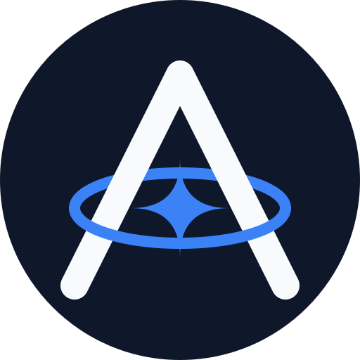

<p align="center">
  
</p>

<h1 align="center">AsterForge</h1>

<p align="center">
  Shared runtime foundation and infrastructure kernel for Aster services.
  <br />
  Product-neutral components, schemas, stores, and lifecycle mechanics for AsterDrive, AsterYggdrasil, and future Aster projects.
</p>

<p align="center">
  <a href="https://forge.astercosm.com/"></a>
  <a href="https://codecov.io/github/AsterCommunity/AsterForge"></a>
  <a href="https://forge.astercosm.com/guide/index"></a>
  <a href="https://forge.astercosm.com/en/index"></a>
  <a href="https://forge.astercosm.com/crates/aster_forge_actix_middleware"></a>
  
  
</p>

<p align="center">
  English | <a href="README.zh.md">中文</a>
</p>

## What is AsterForge?

AsterForge is the shared runtime foundation for Aster products. What started as a home for duplicated helper functions is now the product-neutral infrastructure kernel that Aster services plug into. Forge covers lifecycle management, component registration, health reporting, shutdown ordering, configuration reload, cache backends, database-owned infrastructure tables, mail outbox dispatch, audit log mechanics, scheduled tasks, runtime leases, logging, metrics, panic handling, API helpers, Actix middleware, external-auth connectors, storage key helpers, and validation.

Forge is not a product business framework. Product-specific code — permissions, user-facing API semantics, product entities, task payloads/results, audit action enums, presentation rules, and business repositories — stays in the owning application repositories. Forge only owns what multiple Aster services need in common: product-neutral runtime mechanics, shared database schemas/stores, component graph contracts, retry/claim/lease rules, and cross-process coordination.

The target shape for a new product is a thin entrypoint:

```rust
aster_forge_runtime::AsterRuntime::builder()
    .component(http_component(...))
    .component(database_component(...))
    .component(background_task_component(...))
    .component(mail_outbox_component(...))
    .component(audit_component(...))
    .run()
    .await?;
```

Product code still owns resource creation and business semantics; Forge owns the reusable lifecycle and persistence mechanics behind those components.

All crate names use the `aster_forge_*` prefix. The workspace targets Rust `1.94.0+` and edition 2024, and is dual-licensed under `MIT OR Apache-2.0`.

## Crates

| Area | Crates |
| --- | --- |
| Runtime kernel | [`aster_forge_runtime`](https://forge.astercosm.com/crates/aster_forge_runtime), [`aster_forge_config`](https://forge.astercosm.com/crates/aster_forge_config), [`aster_forge_logging`](https://forge.astercosm.com/crates/aster_forge_logging), [`aster_forge_metrics`](https://forge.astercosm.com/crates/aster_forge_metrics), [`aster_forge_panic`](https://forge.astercosm.com/crates/aster_forge_panic), [`aster_forge_alloc`](https://forge.astercosm.com/crates/aster_forge_alloc) |
| Web and API | [`aster_forge_api`](https://forge.astercosm.com/crates/aster_forge_api), [`aster_forge_api_docs_macros`](https://forge.astercosm.com/crates/aster_forge_api_docs_macros), [`aster_forge_actix_middleware`](https://forge.astercosm.com/crates/aster_forge_actix_middleware), [`aster_forge_actix_observability`](https://forge.astercosm.com/crates/aster_forge_actix_observability), [`aster_forge_external_auth`](https://forge.astercosm.com/crates/aster_forge_external_auth), [`aster_forge_webdav`](https://forge.astercosm.com/crates/aster_forge_webdav) |
| Data, coordination, and background work | [`aster_forge_db`](https://forge.astercosm.com/crates/aster_forge_db), [`aster_forge_cache`](https://forge.astercosm.com/crates/aster_forge_cache), [`aster_forge_tasks`](https://forge.astercosm.com/crates/aster_forge_tasks), [`aster_forge_mail`](https://forge.astercosm.com/crates/aster_forge_mail), [`aster_forge_audit`](https://forge.astercosm.com/crates/aster_forge_audit) |
| Storage and domain-neutral helpers | [`aster_forge_storage_core`](https://forge.astercosm.com/crates/aster_forge_storage_core), [`aster_forge_file_classification`](https://forge.astercosm.com/crates/aster_forge_file_classification) |
| Utilities | [`aster_forge_crypto`](https://forge.astercosm.com/crates/aster_forge_crypto), [`aster_forge_utils`](https://forge.astercosm.com/crates/aster_forge_utils), [`aster_forge_validation`](https://forge.astercosm.com/crates/aster_forge_validation) |

## Integration rules

- Keep product permissions, user-facing errors, business repositories, API semantics, task payloads/results, audit actions/details, and presentation rules in the product repository.
- Use Forge-owned schema/store builders for product-neutral infrastructure tables such as runtime leases, scheduled tasks, mail outbox, and audit logs.
- Register runtime subsystems through Forge components instead of hand-writing shutdown order in product entrypoints.
- Map Forge errors at the product service boundary.
- Write explicit product-side adapters for metrics, runtime config, permission, audit presentation, and policy decisions.
- Use AsterDrive and AsterYggdrasil as references, not as reasons to move business logic into Forge.

See [`New Project Integration`](https://forge.astercosm.com/guide/new-project-integration) for the target new-product shape and [`Integration Principles`](https://forge.astercosm.com/guide/integration-principles) for the detailed boundary rules.

## Service template

Start a new Aster service from the bundled `cargo generate` template:

```bash
cargo generate --git https://github.com/AsterCommunity/AsterForge.git \
  templates/aster-service \
  --name aster_product_service \
  --define server_port=3000
```

The template wires a thin product entrypoint to Forge runtime components. Generation prompts are limited to the package description and HTTP port. Forge dependencies point at the official AsterForge Git repository, with conservative defaults for the server, database, cache, config sync, and logging. The database URL and config sync topic derive from the project name, and file logging stays disabled by default. A migration crate for Forge-owned infrastructure tables is included, and Cargo metadata such as `env!("CARGO_PKG_NAME")` provides the process, health, panic, and placeholder mail display names.

Build and CI follow the AsterDrive model: a pinned toolchain with a split dev profile, isolated debug/test frontend fallbacks, release-time frontend enforcement, tracked OpenAPI/TypeScript artifacts with drift checks, coverage summaries, dependency-triggered audits, and PostgreSQL/MySQL migration smoke jobs. Product repositories still own their business routes, product migrations, config registry, audit enums/details, task payloads/results, and mail template rendering.

## Documentation

- [Documentation site](https://forge.astercosm.com/)
- [Chinese guide](https://forge.astercosm.com/guide/index)
- [New project integration guide](https://forge.astercosm.com/guide/new-project-integration)
- [English overview](https://forge.astercosm.com/en/index)
- [Crate reference pages](https://forge.astercosm.com/crates/aster_forge_actix_middleware)
- [Reference projects](https://forge.astercosm.com/guide/reference-projects)

For now, the Chinese crate pages are the authoritative integration reference; the English pages serve as entry points while the crate-by-crate documentation is being mirrored.

## Development

```bash
cargo check --workspace
cargo test --workspace
cargo fmt --all
```

Documentation site:

```bash
cd docs
bun install
bun run docs:dev
```

## Project structure

```text
crates/                 Rust workspace crates
docs/                   VitePress documentation site and crate reference pages
developer-docs/         Compatibility entry points for developer documentation
scripts/                Repository maintenance scripts
templates/              cargo-generate templates for new Aster services
```

## License

Licensed under either of:

- Apache License, Version 2.0 ([LICENSE-APACHE](LICENSE-APACHE))
- MIT license ([LICENSE-MIT](LICENSE-MIT))

at your option, as declared in the workspace package metadata.
